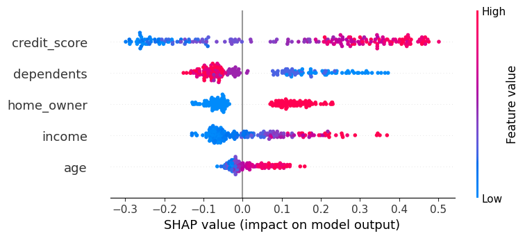
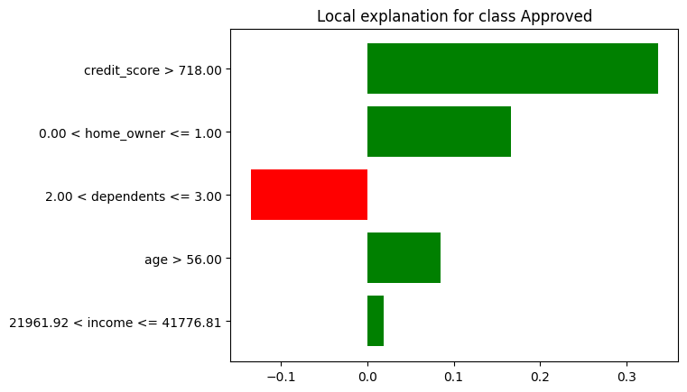

# Interpretable Loan Approval Prediction using Machine Learning, SMOTE, and Explainable AI (SHAP & LIME)


---

## 📌 Overview
This project presents a complete machine learning pipeline for predicting loan approval decisions, enhanced with Explainable AI (XAI) techniques to improve transparency and interpretability.

The framework integrates class imbalance handling using SMOTE and provides both global and local explanations using SHAP and LIME. The goal is to build a model that is not only accurate but also interpretable for real-world financial decision-making.

---

## 🎯 Objectives
- Predict loan approval status using machine learning models  
- Handle class imbalance using SMOTE  
- Improve minority class detection (recall)  
- Provide model interpretability using SHAP and LIME  

---

## 📊 Dataset
The dataset contains applicant-level financial and demographic information:

- Age  
- Income  
- Credit Score  
- Number of Dependents  
- Home Ownership Status  

**Target Variable:**
- `loan_approved` (0 = Not Approved, 1 = Approved)

---

## 🔍 Exploratory Data Analysis (EDA)
Key observations from the dataset:

- The dataset is imbalanced (~78% approved, ~22% rejected)  
- Credit score shows the strongest influence on approval  
- Home ownership positively correlates with loan approval  
- Higher number of dependents reduces approval probability  
- Income has moderate influence, while age has minimal impact  

---

## ⚙️ Methodology

### 1. Data Preprocessing
- Handling missing values  
- Encoding categorical variables  
- Train-test split (80:20)  

### 2. Class Imbalance Handling
- Applied **SMOTE (Synthetic Minority Oversampling Technique)**  
- Improved representation of minority class  

### 3. Model Training
- Logistic Regression (baseline model)  
- Random Forest (with hyperparameter tuning)  

### 4. Model Evaluation
- Accuracy  
- Precision  
- Recall  
- F1-score  

---

## 📈 Results

| Model | Data Type | Accuracy | Recall (Minority Class) |
|------|----------|---------|------------------------|
| Logistic Regression | Original | 0.905 | 0.66 |
| Random Forest | Original | 0.88 | 0.63 |
| Logistic Regression | SMOTE | 0.915 | 0.93 |
| Random Forest (Tuned) | SMOTE | **0.93** | **0.95** |

### 🔥 Key Insight
Applying SMOTE significantly improves minority class detection. The tuned Random Forest model achieves the best overall performance, particularly in terms of recall and F1-score.

---

## 🤖 Explainable AI (XAI)

### 🔹 SHAP (Global + Local Interpretability)
- Identifies **credit score** as the most influential feature  
- Provides global feature importance  
- Explains individual predictions using waterfall plots  

### 🔹 LIME (Local Interpretability)
- Explains predictions for individual instances  
- Confirms consistency with SHAP explanations  

---

## 📊 Sample Outputs

### SHAP Summary Plot


### LIME Explanation


---

## 📁 Project Structure

```
loan-approval-xai/
│
├── data/
│   └── loan_prediction_dataset.csv
│
├── notebooks/
│   └── loan_prediction.ipynb
│
├── outputs/
│   ├── shap_beeswarm.png
│   ├── shap_waterfall.png
│   └── lime_plot.png
│
├── requirements.txt
├── README.md
```

---

## ⚡ How to Run

1. Clone the repository:
```
git clone https://github.com/Gyanam1310/loan_prediction_xai.git
cd loan_prediction_xai
```

2. Install dependencies:
```
pip install -r requirements.txt
```

3. Run the notebook:
```
jupyter notebook notebooks/loan_prediction.ipynb
```

---

## 🔁 Reproducibility
All experiments are reproducible using the provided code and dataset. Random seeds are fixed where applicable to ensure consistent results.

---

## 🚀 Future Work
- Use real-world financial datasets  
- Explore advanced models (XGBoost, Neural Networks)  
- Perform fairness and bias analysis  
- Deploy model as an API or web application  

---

## 🛠️ Tech Stack
- Python  
- Pandas, NumPy  
- Scikit-learn  
- Imbalanced-learn (SMOTE)  
- SHAP  
- LIME  
- Matplotlib, Seaborn  

---

## ⭐ Highlights
- End-to-end ML pipeline  
- Strong focus on interpretability  
- Real-world financial relevance  
- Suitable for research and production use  
